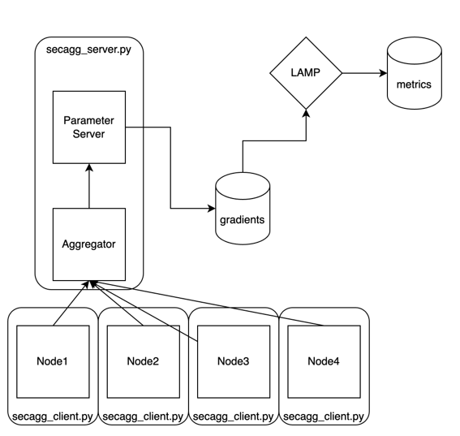
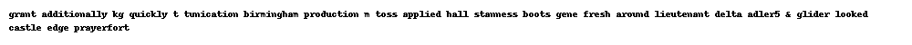
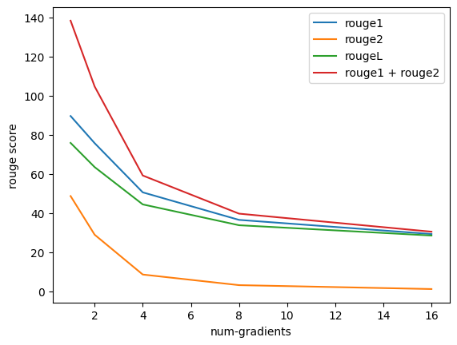
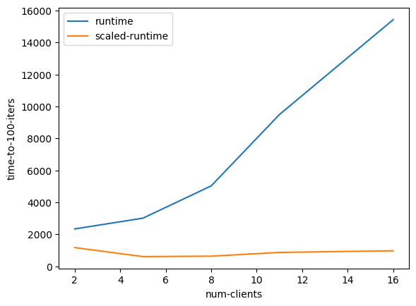
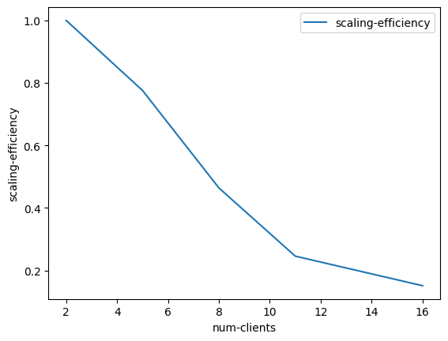

# Reconstruction of Text from Leaked Gradients:​ Attack and Defence against gradient reconstruction attacks​

 This project aims to improve the reconstruction of text data from LAMP, by trying multiple techniques, as well as to test mitigations against gradient leakage attacks using Secure Aggregation.
 
 (Reference: LAMP: Extracting Text from Gradients with Language Model Priors https://github.com/eth-sri/lamp)

[Presentation](https://www.figma.com/proto/O7ve0z38EyGzYmUKJcbkUl/IDLS-Final-Project?page-id=0%3A1&type=design&node-id=1-2&viewport=-1892%2C573%2C0.49&t=6s2tJmhAvt2TWKCF-1&scaling=contain&mode=design)

 
## Project Milestones
1. Setup Gradient reconstruction attack on Large Language Models (Completed)
2. Setup real-life FL scenario to conduct LLM attacks on. (Completed)
3. Perform Secure Aggregation for Federated learning on FL Setup (Completed)
4. Analyse the cost-effectiveness tradeoff of Secure Aggregation against gradient reconstruction attacks. (Completed)

## Table of Contents
- [Repository and Code structure](#repository%20and%20Code%20structure)
- [Running the Code](#Running%20the%20code)
- [Usage](#usage)
- [Results](#results)
- [Citation](#citation)

## Repository and Code structure
1. The repository contains multiple modules containing different parts of the setup
2. ``` secure-aggregation ``` contains the code required to setup multiple clients and server to emulate a federated learning setup with secure aggregation
3. ```lamp-main``` is modified from the original [lamp](https://github.com/eth-sri/lamp) to fit our experiment. It contains the scripts and utilities to perform the gradient reconstruction attack
4. ``` exp-scripts ``` contains the SBATCH scripts used to run the experiment on the HPC Cluster
5. ``` exp-results ``` contains specific logfiles from our experiments, as well as a notebook to perform analysis on our results.
6. ```Figures/``` contains graphical outputs of the project, such as evaluation metrics and process visualizations.
7. `*.py`: Python scripts:
  - `args_factory.py`: Sets up command-line argument parsing.
  - `constants.py`: Defines constant values used throughout the codebase.
  - `data_utils.py`: Provides utilities for data handling.
  - `nlp_utils.py`: Contains utilities for natural language processing tasks.
  - `staleness.py`: Script for running Staleness Experiments.
  - `train-sync.py`: Script for model training in Distributed manner.
  - `utilities.py`: General utility functions.
- `environment.yml`: Contains the conda environment specification.
- `Figures.ipynb`: Jupyter Notebook for generating figures.
- `LICENSE.txt`: The license under which the project is released.
- `README.md`: This file with project information.
- `Results.xlsx`: Spreadsheet with the Experiments' results.
- Output files (`*.out`): Results for single input Demonstartion.

## Running the code
- Install Anaconda. 
- Create the conda environment:<br>
   ```bash
   conda env create -f environment.yml
   ```
- Enable the created environment:<br>
    ```bash
    conda activate dtdr
    ```
- Install Flower
    ```bash
    conda install flwr
    ```
- Download required files:<br>

    ```bash
    wget -r -np -R "index.html*" https://files.sri.inf.ethz.ch/lamp/  
    mv files.sri.inf.ethz.ch/lamp/* ./    
    rm -rf files.sri.inf.ethz.ch
    ```
### Experiments
### 1. Reconstructing data from other clients with staleness


- Train models at Parallel System

    ```bash
    python -m torch.distributed.launch --nproc_per_node=NUM_GPUS train-sync.py --dataset DATASET --batch_size 32 --noise SIGMA --num_steps NUM_STEPS --save_every 1
    ```
model saved to path: SYNC/DATASET/noise_{SIGMA}/{LOCAL_RANK}/{STEPS}
  
- simulate the scenario where the attacker runs a local server and trys to restore the data of other server WITH STALENESS in their model version

    ```bash
    python staleness.py --dataset DATASET --noise SIGMA --steps STEPS --staleness STALENESS --split test --loss cos --n_inputs 5 -b BATCHSIZE --coeff_perplexity 0.2 --coeff_reg 1 --lr 0.01 --lr_decay 0.89 --n_steps 2000
    ```

### 2. Mitigation using Secure Aggregation in Federated Learning to defend against Gradient Reconstruction Attacks

- To start the federated learning server
```bash
python3 secure-aggregation/flwr_server.py
```
- To start a single client which connects to the federated learning server 
```bash
python3 secure-aggregation/flwr_client.py
```
- To attack gradients from TINYBERT on cola dataset:<br>
```bash 
./lamp_cos.sh huawei-noah/TinyBERT_General_6L_768D cola 1
```
- To attack gradients from other models on other datasets
```bash
./lamp_cos.sh DATASET BATCH_SIZE
```

#### Parameters
- *DATASET* - the dataset to use. One of **cola**, **sst2**, **rotten_tomatoes**.
- *SIGMA* - the amount of Gaussian noise with which to train e.g **0.001**. To train without defense set to **0.0**.
- *NUM_STEPSS* - for how many steps to train e.g **1000**.
- *NUM_GPUS* - number of gpus
- *save_every* - steps to save one model, important for simulate stillness.
- *STEPS* - local model version(given the training steps)
- *STALENESS* -staleness between local worker and Parameter Server.
- *BATCHSIZE* -batch size(in our experiment, batch size fixed 1)
- *n_steps* - how many steps take to reconstruct texts
- *n_inputs* - number of texts to run the experiments (one text runs about 10 minutes under 2000 steps) (5 for our experiments)

## Results
## Experiment 1: Reconstruction of gradients with staleness
### Demonstration on single text input

Reference:

```
for anyone who remembers the '60s or is interested in one man's response to stroke , ram dass : fierce grace is worth seeking out .
```

Staleness 0:


| rouge 1 | rouge 2 | rouge L |
|---------|---------|---------|
| 49.057  | 3.922   | 26.415  |


Staleness 1:


| rouge 1 | rouge 2 | rouge L |
|---------|---------|---------|
| 43.137  | 20.408  | 39.216  |

Staleness 10:


| rouge 1 | rouge 2 | rouge L |
|---------|---------|---------|
| 35.294  | 12.245  | 31.373  |

Staleness 20:


| rouge 1 | rouge 2 | rouge L |
|---------|---------|---------|
| 29.630  | 7.692   | 25.926  |


### Averaged Results form staleness of 0 to 20

#### Rouge 1


#### Rouge 2


#### Rouge L


In data restoration, the study revealed that as staleness increases, there is a significant decrease in both rouge-1 and rouge-L scores, indicating that the restoration results become less favorable. Rouge-2 exhibits a high degree of randomness, with initialized embeddings having a substantial impact on rouge-2. Across different datasets, SST-2 and CoLA texts are relatively straightforward, showing less sensitivity to staleness in their restoration. However, for Rotten Tomatoes, given the complexity of its text, an increase in staleness significantly leads to a deterioration in the restoration quality.

## Experiment 2: Using Secure Aggregation to defend against gradient leakage attacks

#### 1 Gradient
| Metric   | FM     | P       | R       |
|----------|--------|---------|---------|
| rouge1   | 89.552 | 89.102  | 90.229  |
| rouge2   | 48.670 | 48.288  | 49.068  |
| rougeL   | 75.817 | 75.403  | 76.326  |
| rougeLsum| 76.191 | 75.774  | 76.736  |

#### 2 Gradients
| Metric   | FM     | P       | R       |
|----------|--------|---------|---------|
| rouge1   | 75.687 | 75.134  | 76.630  |
| rouge2   | 28.935 | 28.768  | 29.308  |
| rougeL   | 63.461 | 63.027  | 64.228  |
| rougeLsum| 63.394 | 62.923  | 64.115  |

#### 4 Gradients
| Metric   | FM     | P       | R       |
|----------|--------|---------|---------|
| rouge1   | 50.568 | 49.875  | 52.045  |
| rouge2   | 8.601  | 8.549   | 8.801   |
| rougeL   | 44.411 | 43.772  | 45.775  |
| rougeLsum| 44.497 | 43.816  | 45.794  |

#### 8 Gradients
| Metric   | FM     | P       | R       |
|----------|--------|---------|---------|
| rouge1   | 36.510 | 36.001  | 38.322  |
| rouge2   | 3.187  | 3.075   | 3.452   |
| rougeL   | 33.782 | 33.300  | 35.464  |
| rougeLsum| 33.772 | 33.247  | 35.439  |

#### 16 Gradients
| Metric   | FM     | P       | R       |
|----------|--------|---------|---------|
| rouge1   | 29.282 | 28.648  | 31.002  |
| rouge2   | 1.196  | 1.180   | 1.297   |
| rougeL   | 28.524 | 27.893  | 30.209  |
| rougeLsum| 28.572 | 27.922  | 30.258  |







We observed that an increase in aggregated gradients greatly reduced the ability of LAMP to reconstruct input. That being said, LAMP still managed to do well on rouge1 and rougeL metrics, being able to guess up to 30% of the input characters in the 16 gradient setup.

At the same time, we noticed an exponential increase in training time from having multiple gradients aggregated. 
With multiple clients, the throughput of the system still increases slightly overall.

Scaling efficiency also decreased significantly with multiple clients due to communication required between clients to share keys as well as the fully-synchronous nature of federated learning with secure-aggregation.

## Citation
```
@inproceedings{
    balunovic2022lamp,
    title={{LAMP}: Extracting Text from Gradients with Language Model Priors},
    author={Mislav Balunovic and Dimitar Iliev Dimitrov and Nikola Jovanovi{\'c} and Martin Vechev},
    booktitle={Advances in Neural Information Processing Systems},
    editor={Alice H. Oh and Alekh Agarwal and Danielle Belgrave and Kyunghyun Cho},
    year={2022},
    url={https://openreview.net/forum?id=6iqd9JAVR1z}
}
```
A good portion of this code is derived from https://github.com/eth-sri/lamp, code accompanying our NeurIPS 2022 paper: [**LAMP: Extracting Text from Gradients with Language Model Priors**](https://openreview.net/forum?id=6iqd9JAVR1z).

