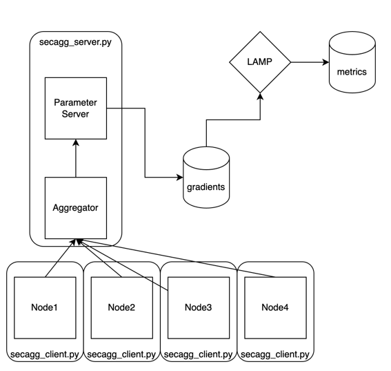
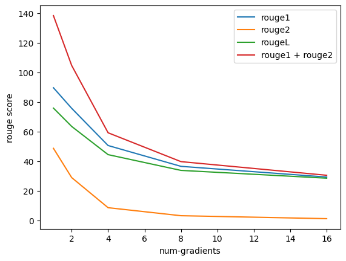
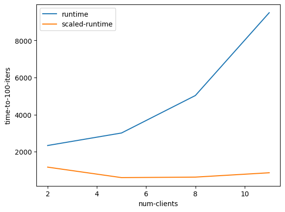
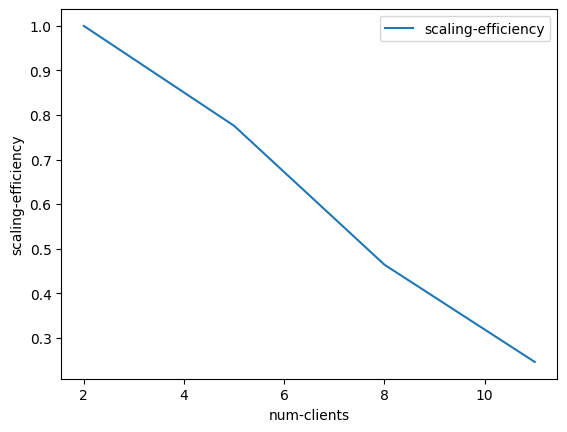

# Reconstruction of Text from Leaked Gradients:​ Attack and Defence against gradient reconstruction attacks​

## This project aims to improve the reconstruction of text data from LAMP, by trying multiple techniques, as well as to test mitigations against gradient leakage attacks using Secure Aggregation.
 
 
## Project Milestones
1. Setup Gradient reconstruction attack on Large Language Models (Completed)
2. Setup real-life FL scenario to conduct LLM attacks on. (Completed)
3. Perform Secure Aggregation for Federated learning on FL Setup (Completed)
4. Analyse the cost-effectiveness tradeoff of Secure Aggregation against gradient reconstruction attacks. (Completed)

## Repository and Code structure
1. The repository contains multiple modules containing different parts of the setup
2. ``` secure-aggregation ``` contains the code required to setup multiple clients and server to emulate a federated learning setup with secure aggregation
3. ```lamp-main``` is modified from the original [lamp](https://github.com/eth-sri/lamp) to fit our experiment. It contains the scripts and utilities to perform the gradient reconstruction attack
4. ``` exp-scripts ``` contains the SBATCH scripts used to run the experiment on the HPC Cluster
5. ``` exp-results ``` contains specific logfiles from our experiments, as well as a notebook to perform analysis on our results.

## Running the code
- Install Anaconda. 
- Create the conda environment:<br>
> conda env create -f environment.yml
- Enable the created environment:<br>
> conda activate lamp
- Download flower
> conda install flwr for secure aggregation
- Download required files:<br>
> wget -r -np -R "index.html*" https://files.sri.inf.ethz.ch/lamp/  
> mv files.sri.inf.ethz.ch/lamp/* ./    
> rm -rf files.sri.inf.ethz.ch

## Experiments

### Parameters
- *DATASET* - the dataset to use. Must be one of **cola**, **sst2**, **rotten_tomatoes**.
- *BERT\_PATH* - the language model to attack. Must be one of **bert-base-uncased**, **huawei-noah/TinyBERT_General_6L_768D**, **models/bert-base-finetuned-cola**, **models/bert-base-finetuned-sst2**, **models/bert-base-finetuned-rottentomatoes** for BERT<sub>BASE</sub>, TinyBERT<sub>6</sub>, and each of the three fine-tuned BERT<sub>BASE</sub>-FT models (on each of the datasets).

### Commands
- To start the federated learning server
> python3 secure-aggregation/flwr_server.py
- To start a single client which connects to the federated learning server 
> python3 secure-aggregation/flwr_client.py
- To run the experiment on LAMP with cosine loss on TINY BERT and cola with batch size of 1:<br>
> ./lamp_cos.sh huawei-noah/TinyBERT_General_6L_768D cola 1
- To run the experiment on LAMP with any other models and datasets
> ./lamp_cos.sh DATASET BATCH_SIZE

## Results
#### Single Gradient
| Metric   | FM     | P       | R       |
|----------|--------|---------|---------|
| rouge1   | 89.552 | 89.102  | 90.229  |
| rouge2   | 48.670 | 48.288  | 49.068  |
| rougeL   | 75.817 | 75.403  | 76.326  |
| rougeLsum| 76.191 | 75.774  | 76.736  |

#### 2 Gradients
| Metric   | FM     | P       | R       |
|----------|--------|---------|---------|
| rouge1   | 75.687 | 75.134  | 76.630  |
| rouge2   | 28.935 | 28.768  | 29.308  |
| rougeL   | 63.461 | 63.027  | 64.228  |
| rougeLsum| 63.394 | 62.923  | 64.115  |

#### 4 Gradients
| Metric   | FM     | P       | R       |
|----------|--------|---------|---------|
| rouge1   | 50.568 | 49.875  | 52.045  |
| rouge2   | 8.601  | 8.549   | 8.801   |
| rougeL   | 44.411 | 43.772  | 45.775  |
| rougeLsum| 44.497 | 43.816  | 45.794  |

#### 8 Gradients
| Metric   | FM     | P       | R       |
|----------|--------|---------|---------|
| rouge1   | 36.510 | 36.001  | 38.322  |
| rouge2   | 3.187  | 3.075   | 3.452   |
| rougeL   | 33.782 | 33.300  | 35.464  |
| rougeLsum| 33.772 | 33.247  | 35.439  |

#### 16 Gradients
| Metric   | FM     | P       | R       |
|----------|--------|---------|---------|
| rouge1   | 29.282 | 28.648  | 31.002  |
| rouge2   | 1.196  | 1.180   | 1.297   |
| rougeL   | 28.524 | 27.893  | 30.209  |
| rougeLsum| 28.572 | 27.922  | 30.258  |

We observed that an increase in aggregated gradients greatly reduced the ability of LAMP to reconstruct input. That being said, LAMP still managed to do well on rouge1 and rougeL metrics, being able to guess up to 30% of the input characters in the 16 gradient setup.


At the same time, we noticed an exponential increase in training time from having multiple gradients aggregated. 
With multiple clients, the throughput of the system still increases slightly overall.

Scaling efficiency also decreased significantly with multiple clients due to communication required between clients to share keys as well as the fully-synchronous nature of federated learning with secure-aggregation.


## Citation
```
@inproceedings{
    balunovic2022lamp,
    title={{LAMP}: Extracting Text from Gradients with Language Model Priors},
    author={Mislav Balunovic and Dimitar Iliev Dimitrov and Nikola Jovanovi{\'c} and Martin Vechev},
    booktitle={Advances in Neural Information Processing Systems},
    editor={Alice H. Oh and Alekh Agarwal and Danielle Belgrave and Kyunghyun Cho},
    year={2022},
    url={https://openreview.net/forum?id=6iqd9JAVR1z}
}
```
A good portion of this code is derived from https://github.com/eth-sri/lamp, code accompanying our NeurIPS 2022 paper: [**LAMP: Extracting Text from Gradients with Language Model Priors**](https://openreview.net/forum?id=6iqd9JAVR1z).

